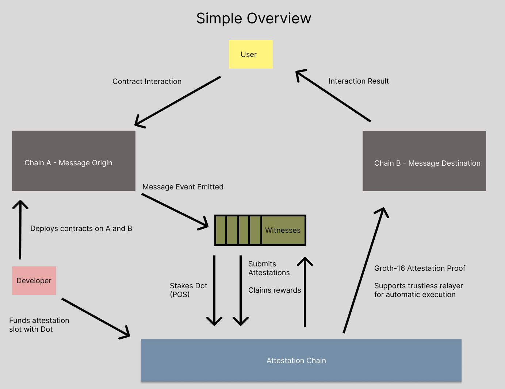

# Proposal Discussion
## Janus,  Trustless Cross-chain Messaging infrastructure with ZK Attestation, powered by Polkadot

This is a discussion for a future proposal, to build a universal cross-chain messaging solution, secured by Dot staking. This is a public good,a developer infrastructure that makes Polkadot the center of all cross-chain communication.

## Abstract

We are in the multichain era where DApps are scattered around on many chains. Users of the decentralized networks must learn to navigate this landscape to use DApps and a lot of this navigation depends on trusted third-parties like a CEX, or bridges which are prone to hacking. The goal is to put Polkadot into the center of this cross-chain messaging so it can lend some of it's security to a trustless protocol that facilitates messaging between existing chains.

## The problem

Trustless is hard. Centralized bridges are a liability, cross-chain messaging UX is bad and can't b e uses by novice users. There is no infrastructure that is truly compatible with all chains.

## The proposed solution

An attestation parachain on Polkadot for cross-chain witnesses that observe events, and create and confirm attestations.
Attestation proofs using ZKP. Groth16 is the Lingua franca of cross-chain communication.

## How it works?

1. The developer deploys on Chain A and Chain B. The messages will be passed between these 2.
2. The developer funds an attestation slot on the attestation chain with DOT.
3. Witnesses stake DOT to operate, in-case of malicious behavior their stake is slashed.
4. Witnesses watch Chain A for message events
5. Witness submits attestation to the chain and confirms existing attestations
6. Witness claims reward when attestation is confirmed to be valid.
7. Signed attestations are aggregated into a Groth-16 proof
8. Proof is verified on Chain B.
9. Supports account abstraction with trustless Snarks. Optionally Chain B can reward valid proofs with fees to decentralize message relaying.
10. User sees his interaction result on Chain B 

## How the cryptography works?

Witnesses use EDDSA using Poseidon Hash which is verified using ZKP (circom EDDSA)

When staking, claiming rewards, and submitting attestations and confirmations, the withesses sign messages using EDDSA which is verified on the attestation chain using Groth-16.

The attestation chain stores the leaves of a  Merkle Tree of Witnesses who are allowed to use the attestation slot.

The developer must store the merkle root of the allowed witnesses on the Chain B contract for the final message verification.

The witnesses allowed to attest are verifiable on both the attestation chain and final message destination chain.

The Groth-16 proof to the message destination verifies N of M Witnesses agree on the message validity and the witness public keys are in the merkle root.

This creates a trustless cross-chain messaging infrastructure, secured by DOT staking, that works with all smart contract chains supporting Groth-16 verification.

## The development work that needs to be done

1. Two Circom Ciruits for ZKP
  * Verify an EDDSA signature
  * Verify multiple EDDSA signatures and check if they are stored in a merkle root
2. Messsage emitter interfaces developed in multiple smart contract languages (Rust, Solidity, Move, FunC)
3. Witness CLI and Daemon developed using NodeJs and CircomlibJs.
   * Contains a Wallet for staking and claiming rewards
   * EDDSA signatures with circomlibjs
   * API to watch origin chains and submit attestations to the appchain
4. Attestation Parachain for Polkadot
   * An AppChain
   * Uses DOT as a token
   * Provides Configurable Attestation Slots
   * Developers using it funds witnesses with DOT
   * Witnesses stake DOT and claim rewards
5. Destination Smart Contract Verifier (Rust, Solidity, Move, FunC) 
6. Trustless relayer written in nodejs with it's code reusable in the browser for manual use. (E.g: Instead of abstractions, the user needs to interact twice)
7. A custom chain explorer that will provide insight into the appchain and allow full interaction with it, and shows the transactions on both the origin and destination chains.
8. Developer Documentation with examples and 1 click deployments

## Cost Estimates
The costs are based on development time which is async. 
The hours will be tracked and linked to commits.

The estimated time to reach stable testnet is at least 1 year. 

This is full stack cross-chain blockchain development, using Rust, circom, solidity, move, FunC, and NodeJs, and Golang, HTML, CSS, TS

### Development cost:

128USD/hour + 42% tax (based on my current location in Scandinavia, it does not include all taxes only the minimum)

Final Price: 1 year with 40 hour weeks is $245 760 USD + $103 219 USD in legal fees
 
Requested amount for 1 year is : 348 979 USD

### Mainnet costs:
Estimated $300 000 USD audit costs and 50k hardware infrastructure costs. better estimates will be created when this point is reached.

### Maintenance:
Requesting 1 year worth of development time, which will be spent more slowly as the development frequency decreases. 

### Marketing strategy
This is an infrastructure aimed at developers, it's direct use is abstracted from end users. 
The chain provides no investment or new tokens and needs to be marketed only to developers.

The best way to do this is bounties and hackathons. A hackathon founded by the Polkadot Treasury.
Hackathons and bounties would incentivize developers to build on this infrastructure.

Example: 1000 USD bounty for developers and 500$ in Dot deposited into the attestation slot.

### Proof of work before funding
The circom circuits and the witness can be developed before 1 year of development time is funded. The Witness will use mock origin, appchain and destinations and will only contains the critical cryptography. 

### Use-Cases
* Trustless Bridges
* Multi Chain Tokens
* Cross chain DEX Swap Routes
* Cross chain DeFi
* Arbitrage trades
* Minimum Extractable Value Source
* Account Abstraction
* Cross chain intents
* Connecting ecosystems
* Multi-Chain DAO treasury
